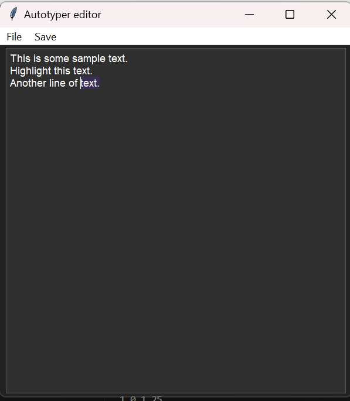
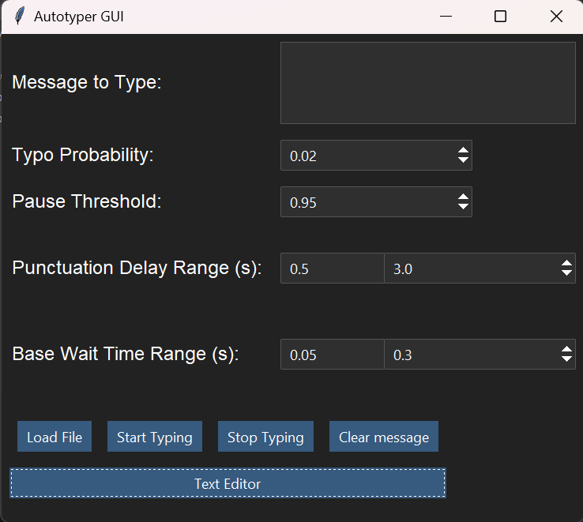

# Auto_typer
A simple Autotyper designed to mimic human typing with adjustable parameters such as Typo_probability PAUSE_THRESHOLD, PUNCTUATION_DELAY_RANGE etc. Exe available in releases included is a simple text editor with a command pallete opened by pressing alt and ability to load files maybe in the future ai functionality will be added for ex- ai obscurance features. Tkinter was used and inspiration from obsidian for the font and highlight colour. 

